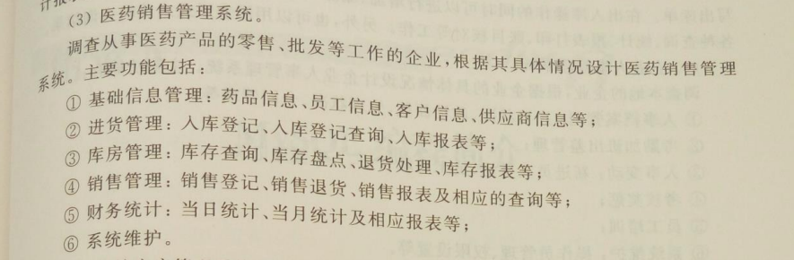

# 医药销售管理系统

中山大学数据库实验项目 - 完整的医药销售管理系统



## 🎯 项目简介

基于 Flask + SQLAlchemy 的医药销售管理系统，支持17个数据库表的全面管理，包含数据仪表盘、基础信息管理、库存管理、销售管理等功能模块。

## ⚡ 快速开始

### 环境要求
- Python 3.11+
- Flask 3.1.2
- SQLAlchemy 2.0.43

### 安装依赖
```bash
pip install flask flask-sqlalchemy
```

### 启动应用
```bash
# 激活环境
conda activate myblog

# 运行应用
python app.py

# 初始化测试数据（可选）
python init_data.py
```

### 访问系统
浏览器访问：http://127.0.0.1:5000

## 📚 核心功能

### 1. 数据仪表盘
- 📊 实时销售趋势图表
- 📈 库存状态可视化
- 🏆 热销药品排行
- 💰 关键指标统计

### 2. 基础信息管理
- 💊 **药品管理**：药品信息的增删改查
- 👥 **员工管理**：员工档案管理
- 🏪 **客户管理**：客户信息维护
- 🏭 **供应商管理**：供应商档案管理

### 3. 库存管理
- 📥 **入库登记**：药品入库及库存自动更新
- 📦 **库存查询**：多维度库存统计
- 🏢 **仓库管理**：仓库信息管理
- ✅ **库存盘点**：盘点记录及盈亏统计
- ↩️ **退货处理**：退货登记及库存调整

### 4. 销售管理
- 💰 **销售登记**：销售记录及库存扣减
- 🔄 **销售退货**：退货处理及库存恢复
- 💵 **财务统计**：收入支出及利润分析
- 📈 **销售报表**：多维度销售分析

### 5. 测试系统
- 🎲 **测试数据生成**：一键生成测试数据
- ⚡ **批量操作测试**：批量入库、销售测试
- 🚀 **全链路测试**：自动化端到端测试
- 📝 **测试日志**：实时测试结果展示

## 🎨 UI特性

- ✨ 现代化渐变色设计
- 🎭 流畅的动画效果
- 📱 响应式布局
- 🔔 实时消息提示
- 🎲 表单快速填充功能
- ✅ 智能表单验证

## 📁 技术架构

### 后端
- **Flask 3.1.2** - Web框架
- **SQLAlchemy 2.0.43** - ORM映射
- **SQLite** - 数据库

### 前端
- **Jinja2** - 模板引擎
- **Chart.js 3.9.1** - 数据可视化
- **原生JavaScript** - 交互逻辑
- **CSS3动画** - 视觉效果

## 📖 文档导航

- [📘 项目指南](项目指南.md) - 完整使用文档、API接口、部署指南
- [📐 数据库设计](数据库设计.md) - 数据库表结构设计
- [👥 项目分工](分工.md) - 团队分工说明

## 🚀 生产部署

### 使用 Gunicorn
```bash
# 安装Gunicorn
pip install gunicorn

# 使用配置文件启动
gunicorn -c gunicorn_config.py app:app

# 或直接启动
gunicorn -w 4 -b 0.0.0.0:5000 app:app
```

详细部署指南请查看 [项目指南.md](项目指南.md)

## 🔧 配置说明

### 资源限制
- 最大请求体：16MB
- 会话超时：1小时
- JSON响应不排序

### 性能优化
- 支持多进程（Gunicorn）
- 数据库连接池
- 查询结果缓存
- 静态资源CDN

详见 `config.py` 和 `gunicorn_config.py`

## 📊 数据库表结构

系统包含17个核心数据表：

**基础信息表**：
- drug_info（药品信息）
- employee_info（员工信息）
- customer_info（客户信息）
- supplier_info（供应商信息）

**库存管理表**：
- warehouse（仓库）
- inventory（库存）
- stock_in（入库记录）
- stock_checking（盘点记录）
- stock_return（退货记录）
- stock_out（出库记录）

**销售管理表**：
- sales（销售记录）
- sales_return（销售退货）
- finance_stat（财务统计）
- sales_week_report（周销售报表）

**其他表**：
- prescription（处方）
- prescription_detail（处方明细）
- login_log（登录日志）

详细设计请查看 [数据库设计.md](数据库设计.md)

## 🧪 测试功能

访问 **系统测试 → API测试控制台** 进行：

1. **数据生成测试**：批量生成药品、客户数据
2. **性能测试**：批量入库、销售操作测试
3. **全链路测试**：端到端自动化测试
4. **监控统计**：实时系统数据统计

## 🔐 安全特性

- SQL注入防护（参数化查询）
- XSS防护（Jinja2自动转义）
- 表单验证（前后端双重验证）
- 会话管理（超时自动过期）

## 📞 联系方式

- 项目负责人：见 [分工.md](分工.md)
- 技术支持：查看项目Issues
- 课程：中山大学数据库实验

## 📄 许可证

本项目仅供学习和研究使用。

---

**开发环境：** Python 3.11 + Flask 3.1.2 + SQLAlchemy 2.0.43  
**最后更新：** 2024年
